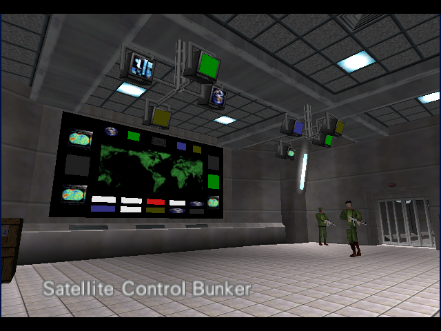
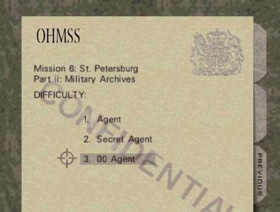
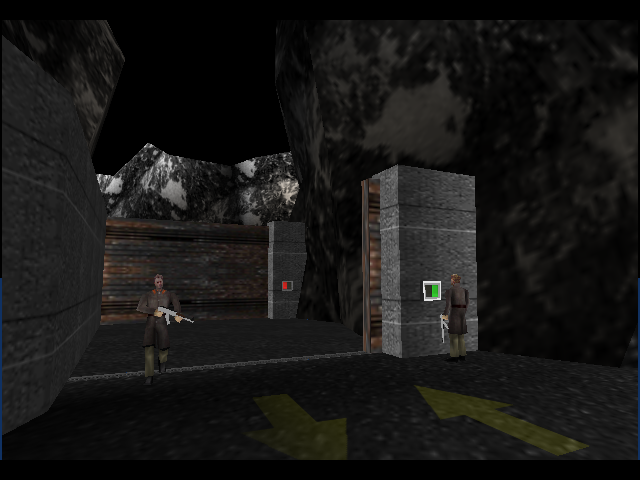

# GoldenEye 007 PC Port

[](https://github.com/jkdansereau/goldeneye-pc-port/actions/workflows/ci.yml)


A native PC port of _GoldenEye 007_ (Rare, 1997, Nintendo 64), compiled from
the [GoldenEye 007 decompilation](https://github.com/n64decomp/007): the
original N64 game running from reconstructed source, not the Xbox 360
remaster. **v0.2.0 (pre-release)** is out for Windows and Linux — including
Steam Deck, where the Linux bundle sideloads as-is — and runs the full
campaign at a steady 60 fps with known rough edges (see
[Status](#status) and [Download](#download)).

It's also a case study in AI-agent collaboration on a large, low-level
codebase: two coding agents, driven by one person part-time, porting ~230
translation units of unmodified big-endian MIPS game code to a 64-bit
desktop. See [Background](#background).

Technically, it follows the architecture of the
[Perfect Dark PC port](https://github.com/fgsfdsfgs/perfect_dark), the same
Rare "Indy" engine family, one hardware generation apart. The unmodified game
C sources are compiled for the host; the N64's Reality Signal Processor (RSP)
is emulated in software; every other hardware surface (video, audio, input,
timers, save storage) is shimmed in a dedicated `port/` layer.

> [!IMPORTANT]
> **You must supply your own GoldenEye 007 ROM.** This repository contains no
> Nintendo code or assets, and no ROM. Nothing here is distributable as a
> playable game — see [Requirements](#requirements) and [Legal](#legal).

<p align="center">
  
  
  
  <br><em>In-engine, running in the port — Bunker&nbsp;1 and Dam attract views, and a
  ~15&nbsp;s clip (the clip itself has no audio track): mission dossier &rarr;
  Facility &rarr; Silo &rarr; Jungle &rarr; Archives.</em>
</p>

## Quick start

You supply your own **NTSC-U GoldenEye 007 N64 ROM** (`.z64`, big-endian) — no
ROM or game asset is included or distributed. Then:

1. Download the Windows or Linux bundle from [Releases](../../releases) and unpack it. The Linux bundle ships its own SDL2, so it runs on any distro — and on a Steam Deck — with nothing installed.
2. Make a `data/` folder next to the executable and drop the ROM in as `ge007.ntsc-final.z64`.
3. Run the one-time asset step: `python3 prepare-assets/prepare-assets.py` (Python 3.8+, stdlib only).
4. Launch the executable from that folder.

Building from source instead: see [Building](#building). Read the
[Status](#status) caveats first — this is a pre-release.

## Contents

- [Quick start](#quick-start)
- [Background](#background)
- [How this differs from the other GoldenEye PC projects](#how-this-differs-from-the-other-goldeneye-pc-projects)
- [Status](#status)
- [Download](#download)
- [Requirements](#requirements)
- [Building](#building) · [Windows (MSYS2)](#windows-msys2) · [Linux](#linux)
- [Running](#running) · [Default controls](#default-controls)
- [How it works](#how-it-works)
- [Project layout](#project-layout)
- [Documentation](#documentation)
- [Credits](#credits)
- [Legal](#legal)
- [License](#license)

## Background

The port used two agents handing work back and forth through shared written
notes (a running handoff doc), directed by one person part-time:

- a **local open-weight model** —
  `unsloth/Qwen3.8-27B-GGUF:UD-Q4_K_XL` on a single **RTX 5090**, driven mainly
  through the **[pi](https://pi.dev/)** coding agent — which did the
  groundwork: the CMake build, the boot chain, the software-RSP integration,
  the offline asset-conversion pipeline, and the first rendered frames;
- **Claude** (via **Claude Code** — mostly **Sonnet 5**, with **Opus 5** as an
  escalation tier for the hardest bugs), which joined for a collaborative
  phase covering the 21-level load/render/no-crash sweep, the ABI/layout
  finding catalog, the SDL input layer, and the front-end flow.

In short: ~3.5 weeks, one person part-time, two agents, ~430 commits, 200+
root-caused bugs logged. The full write-up (timeline, the handoff mechanism,
commit/effort breakdown, and an honest "what worked / what didn't") lives in
[`docs/dev/agentic-development.md`](docs/dev/agentic-development.md). The
workflow itself: [`docs/dev-process.md`](docs/dev-process.md). To cite this
project or its findings, use [`CITATION.cff`](CITATION.cff) (GitHub's "Cite
this repository" menu).

## How this differs from the other GoldenEye PC projects

This is a native port of the original 1997 Nintendo 64 game, built from its
actual reconstructed source code, the same lineage as the Perfect Dark PC
port. The other well-known "GoldenEye on PC" projects are something
different: they machine-translate the shipped binary of the *unreleased Xbox
360 XBLA remaster*, a different game on a different codebase with no shared
code with this one.

| | This project | [GoldenEye-Recomp](https://github.com/SunJaycy/GoldenEye-Recomp) / [Steam Deck build](https://github.com/couchk1ng/GoldenEye-Recomp-SteamDeck) |
|---|---|---|
| **What it ports** | The original **Nintendo 64** game (1997) | The **Xbox 360 XBLA** HD remaster (built ~2007, never released) |
| **How** | Decompilation-based source port — human-reconstructed C, compiled for the host; game logic runs as written | Static binary recompilation — the shipped machine code is auto-translated to C; no source-level understanding |
| **Lineage** | [GoldenEye 007 decompilation](https://github.com/n64decomp/007) + [Perfect Dark PC port](https://github.com/fgsfdsfgs/perfect_dark) engine family | Xbox 360 "…Recompiled" static-recompilation family |
| **Renderer** | Software RSP → OpenGL | Hardware (Vulkan) |
| **Status** | v0.2.0 pre-release; see [Status](#status) | Playable full game, higher frame rates, online multiplayer |
| **Why it exists** | A [case study in AI-agent collaboration](#background) on a hard low-level codebase | A polished, playable PC release of the remaster |

If you just want to play GoldenEye on PC today, use one of the recompilation
projects: they are finished and this is not. What's here is the other half,
getting the *original* game running from source.

## Status

**v0.2.0 (pre-release) — playable, with known rough edges.** It runs the full
single-player campaign at a steady 60 fps with no known crashes, but
cutscenes still glitch frequently, a few in-level music tracks sound wrong,
and a handful of cosmetic rendering defects remain. A full end-to-end
re-confirmation that all 21 missions are completable start to finish on this
build is the point of the pre-release — playtest feedback is welcome.

**Working**

- Boot → Rare/Nintendo logos → gun-barrel → cast intro, fully rendered.
- Front end: main menu → mission select → difficulty → briefing → mission start.
- All 21 solo missions load, render, and are crash-free. The v0.1.0-era
  crashing levels (Bunker ii, Statue) and the AI-pacing bug that blocked the
  final level (Cradle) were root-caused, fixed, and playtest-verified (D191,
  D193). See [`docs/dev/LEVEL-STATUS.md`](docs/dev/LEVEL-STATUS.md).
- **Steady 60 fps** in normal play — the software RSP runs off the
  presentation critical path (D248); `Video.DisplayFPS` (F10) shows it.
- Software RSP (fast3d): textured world geometry, skeletal characters, HUD,
  the GE-specific color-combiner / render modes and `G_TRI4`; outdoor skies
  render correctly (D227); water no longer renders green/pulsing (D229).
- Input: keyboard + mouse and SDL game controllers mapped onto the N64 pad.
  Mouse is click-to-lock (click to grab, ESC to release) with a GEPD-style
  proportional aim mode (D194 closed); sensitivity, Y-inversion and the
  aim/turn split are tunable in `ge007.ini` or the F10 options overlay.
- File-backed EEPROM saves.
- Audio — software mixer (libultra audio layer → SDL, adapted from the PD
  port). In-level sound effects and in-level music both play (the D77
  silence is fixed).
- QoL: F10 in-game options overlay (fullscreen, resolution, frame cap, MSAA,
  texture filtering, FOV/draw distance, sensitivity), mute-on-focus-loss, F12
  screenshot.
- Windows and Linux (`x86_64`). The Linux build is compiled on every push by
  CI and ships with SDL2 bundled, so it runs without installing anything —
  including on a Steam Deck (see below).

**Not yet working / known issues**

- **Cutscenes** — frequently glitch: skipped beats, wrong camera, misplaced or
  hovering actors, wrong timing (D148/D160/D173; the Dam level-end race is
  D243). The most visible gap in this release.
- **Audio quality on some in-level tracks** — wrong-sounding instruments and
  occasional garbling (D230); silence itself is fixed.
- Some front-end 3D models — the spinning Nintendo logo, and the MISSION
  COMPLETE / mode-select models — are mispositioned or absent (D75). The
  gun-barrel Bond intro renders correctly.
- **Particle colours cycle through a rainbow palette** — bullet-impact sparks
  and lingering smoke/explosion residue drift through the hues over time
  instead of holding their intended grey/orange palette (D252; suspect is the
  RGBA16 fire-tile width/height in the texture importer).
- Water on `IsWater` levels shows a moving seam between two patterns (D245);
  pixel strips at the left/right screen edges at non-integer scales (D246).
  Assorted other cosmetic defects are tracked in
  [`docs/dev/GRAPHICS-BACKLOG.md`](docs/dev/GRAPHICS-BACKLOG.md).
- No macOS or ARM support; no controller rebinding UI; no widescreen.

### Steam Deck

The Linux bundle is the Deck build. Sideload it (USB or a file manager):
unzip, drop your ROM in `data/`, run `prepare-assets` once, and add the
executable as a non-Steam game. SDL2 is bundled, so no dependencies need
installing. The renderer is CPU-bound (software RSP); expect original N64-era
performance at 60 fps rather than more. A v0.1.0-era crash on the Deck in
Facility (D203) was never reproduced and its prime suspect has since been
fixed, but this release has not yet been verified on real Deck hardware.

## Download

**Get v0.2.0 (pre-release):**

- **Windows:** [`goldeneye-pc-port-0.2.0-pre-win64.zip`](../../releases) —
  the engine, its runtime DLLs, and the one-time `prepare-assets` tool.
- **Linux / Steam Deck:** [`goldeneye-pc-port-0.2.0-pre-linux-x86_64.tar.gz`](../../releases)
  — same contents; SDL2 is bundled so it runs as-is on any distro or a
  sideloaded Deck.

Both bundles contain **no ROM and no game assets** — you supply your own
(see [Requirements](#requirements)), which keeps the release legal to
distribute. The four steps from download to playing are in
[Quick start](#quick-start); known issues are listed under
[Status](#status). Earlier builds: v0.1.0 alpha, same page.

You can also build it yourself; see [Building](#building).

## Requirements

You need a GoldenEye 007 (Nintendo 64) ROM that you legally own, in
big-endian (`.z64`) format, matching one of:

| Region | ROMID | ROM filename (in `data/`) | SHA-1 |
|--------|-------|---------------------------|-------|
| NTSC-U (US)  | `ntsc-final` | `ge007.ntsc-final.z64` | `abe01e4aeb033b6c0836819f549c791b26cfde83` |
| PAL (EU)     | `pal-final`  | `ge007.pal-final.z64`  | `167c3c433dec1f1eb921736f7d53fac8cb45ee31` |
| NTSC-J (JP)  | `jpn-final`  | `ge007.jpn-final.z64`  | `2a5dade32f7fad6c73c659d2026994632c1b3174` |

US is the recommended and best-tested version.

The port also relies on the decompilation's asset-extraction step, which pulls
the level, model, texture and music data out of your ROM at build time. That
step, too, requires your ROM and is part of [Building](#building).

## Building

Prerequisites: CMake >= 3.16, a C/C++ toolchain, SDL2, zlib, OpenGL, Python 3,
plus the decompilation's own build dependencies (an IRIX MIPS toolchain via
`qemu-irix`, used only for the one-time asset extraction). See
[`docs/building.md`](docs/building.md) for the full walkthrough and the
asset-extraction details.

### Windows (MSYS2)

```sh
# in the MINGW64 shell
pacman -S mingw-w64-x86_64-toolchain mingw-w64-x86_64-SDL2 \
          mingw-w64-x86_64-zlib mingw-w64-x86_64-cmake \
          mingw-w64-x86_64-python make git

git clone https://github.com/jkdansereau/goldeneye-pc-port.git
cd goldeneye-pc-port
# 1. extract assets from your ROM (see docs/building.md)
# 2. build the port
./build-pc.sh ntsc-final          # or pal-final / jpn-final
```

### Linux

The Linux build is compiled on every push by CI (ubuntu-24.04); the release
bundle additionally bundles SDL2 so no system packages are needed at runtime.

```sh
sudo apt install build-essential cmake python3 libsdl2-dev zlib1g-dev libgl1-mesa-dev
git clone https://github.com/jkdansereau/goldeneye-pc-port.git
cd goldeneye-pc-port
# extract assets (docs/building.md), then:
./build-pc.sh ntsc-final
```

The executable is written to `build-pc/ge007.x86_64` (on Windows,
`build-pc/ge007.x86_64.exe`).

## Running

1. Create a `data/` directory in the repo root.
2. Put your ROM in it, named as in the table above
   (e.g. `data/ge007.ntsc-final.z64`).
3. Run the executable from the repo root:
   `./build-pc/ge007.x86_64`.

Configuration is written to `ge007.ini` on first run.

### Default controls

| Action              | Keyboard / mouse         | Controller    |
|---------------------|--------------------------|---------------|
| Move / strafe       | `W` `A` `S` `D` / arrows  | Left stick    |
| Aim / look          | Mouse                    | Right stick   |
| Fire (Z)            | Left mouse / `LCtrl`     | Right trigger |
| Aim mode (R)        | Right mouse / `LShift`   | Left trigger  |
| Use / accept (A)    | `Space` / `E` / `X`            | A / X         |
| Reload / cancel (B) | `R` / `F`                | B / Y / RB    |
| L trigger           | `Q`                      | LB            |
| Start               | `Enter` / `Tab`          | Start         |

Mouse sensitivity, Y-inversion and the aim/turn split are tunable in the
`[Input]` section of `ge007.ini`.

## How it works

The R4300 game code in `src/` is compiled completely unmodified; the
decompilation's control flow is treated as ground truth. Everything that
would touch N64 hardware is redirected into `port/`:

- **`port/fast3d/`** — a software RSP. It interprets the GBI display list the
  game builds each frame and emits OpenGL, bypassing the RDP. Adapted from the
  Perfect Dark port and extended for GoldenEye's custom GBI.
- **`port/src/gesched.c`** — replaces the RCP scheduler; instead of poking RSP
  registers it drives the software RSP directly.
- **`port/src/libultra.c`** — single-threaded shims for the libultra OS API
  (threads, messages, timers, PI/SI/AI/VI) over the host.
- **`port/src/{video,audio,input,fs,romdata,config}.c`** — the SDL2 / OpenGL /
  filesystem backends.

The 32→64-bit transition forces a small, cataloged class of mechanical
ABI-only edits to ROM-serialized structs (pointer-width reconciliation); these
change no behavior and are documented individually.

Where it diverges from the Perfect Dark port: GoldenEye's N64 serialized asset
formats (level setup, models, backgrounds) are converted offline by a set
of Python "sidecar" converters in `tools_pc/`, rather than fixed up at load
time. See [`docs/internals.md`](docs/internals.md) and
[`docs/porting-notes.md`](docs/porting-notes.md).

## Project layout

```
CMakeLists.txt      PC build (parallel to the decomp's Makefile, which is untouched)
build-pc.sh         configure + build helper
src/  include/      the decompilation (game + libultra) - compiled unmodified
port/
  fast3d/           software RSP -> OpenGL
  src/              port layer (main, OS shims, video, audio, input, fs, ...)
  include/          port-facing headers
tools/  Makefile    the N64 build + asset extraction (from the decomp; do not modify)
tools_pc/           PC-port helper + analysis scripts
docs/               see below
```

## Documentation

Key docs are also published as a site:
<https://jkdansereau.github.io/goldeneye-pc-port/>.

| Doc | What's in it |
|---|---|
| [`docs/building.md`](docs/building.md) | Full build + asset-extraction guide. |
| [`docs/internals.md`](docs/internals.md) | Architecture, the RSP-emulation approach, GE-vs-PD engine differences, the phased plan. |
| [`docs/porting-notes.md`](docs/porting-notes.md) | The recurring N64→PC bug classes hit during the port, with fixes. |
| [`docs/dev/agentic-development.md`](docs/dev/agentic-development.md) | The research angle: the two-agent setup, timeline, handoff workflow, and an assessment of what did and didn't work. |
| [`docs/dev-process.md`](docs/dev-process.md) | The investigation workflow in detail — budgets, file partitioning, the finding-log discipline. |
| [`docs/dev/`](docs/dev/) | The raw engineering record: the full finding log, per-level status, graphics backlog, playtest matrices, and [`docs/dev/game-behavior-reference.md`](docs/dev/game-behavior-reference.md) (a secondary-sourced playtest reference for how the retail game is meant to behave — repo-only, code is ground truth). |
| [`docs/SetupGuide.md`](docs/SetupGuide.md), [`docs/StyleGuide.md`](docs/StyleGuide.md) | Inherited from the decompilation this repo forks. |

## Credits

This port is a thin layer on a large amount of other people's work.

**Prior work it is built on**

- The [GoldenEye 007 decompilation](https://github.com/n64decomp/007) — years of
  effort by Larry Ficken ("kholdfuzion") and the project's contributors; plus
  zoinkity's GoldenEye documentation, which the decomp started from. This port
  is a fork of that repository.
- The [Perfect Dark PC port](https://github.com/fgsfdsfgs/perfect_dark)
  (Ryan Dwyer and contributors) — the reference architecture for this port and
  the source of the `fast3d` software RSP.
- The [Perfect Dark decompilation](https://github.com/n64decomp/perfect_dark) —
  the sibling decomp the PD port is built on.
- **Carnivorous** — author of the *Mouse Injector* input plugin for 1964 (the
  "GEPD Edition" bundle). Its mouse-aim behaviour for GoldenEye/Perfect Dark is
  what our in-game GEPD-style aim mode is modelled on; the implementation here
  is an independent reimplementation of that behaviour, not derived code.
  Thanks also to **Rice** and **schibo** of the 1964 team for the emulator it
  shipped with.

**Vendored / adapted code**

- `port/fast3d/` — the software RSP, adapted from the PD port. It originates
  with the [Ship of Harkinian](https://github.com/HarbourMasters) /
  libultraship fast3d (© Emill, MaikelChan; MIT — see `port/fast3d/LICENSE.txt`),
  which itself descends from
  [sm64-port](https://github.com/sm64-port/sm64-port)'s fast3d and audio mixer.
- `port/fast3d/glad/` — OpenGL loader generated by
  [glad](https://github.com/Dav1dde/glad) (David Herberth, MIT).
- The decompilation toolchain: [`ido-static-recomp`](https://github.com/decompals/ido-static-recomp)
  (Emill / decompals), [`qemu-irix`](https://github.com/n64decomp/qemu-irix) and
  `rabbitizer` (n64decomp).
- [SDL2](https://libsdl.org) and [zlib](https://zlib.net).

**Methodology**

- Chris Lewis, [*"Decompiling a Nintendo 64 Game in 84 Days"*](https://blog.chrislewis.au/decompiling-a-nintendo-64-game-in-84-days/) (the Snowboard
  Kids decompilation write-up) — the agent-workflow practices in
  [`docs/dev-process.md`](docs/dev-process.md) are adapted from it.

**Tools and models used to develop the port**

- Qwen 3.8 (Alibaba Qwen team), run locally as the
  [`unsloth/Qwen3.8-27B-GGUF`](https://huggingface.co/unsloth/Qwen3.8-27B-GGUF)
  `UD-Q4_K_XL` quant;
  [Unsloth](https://unsloth.ai) (the GGUF quantisation and Unsloth Desktop,
  used as the local model server).
- [pi](https://pi.dev/) — the local coding-agent harness.
- [Claude / Claude Code](https://claude.com/claude-code) (Anthropic).

## Legal

This is a non-commercial fan preservation/research project, in the same
category as the many other N64 decompilation and native-port repositories on
GitHub. It follows the same conventions they do:

- **No ROM and no game assets are distributed** — not in this repository and
  not in any release. Textures, audio, models, level data and in-game text are
  extracted from a ROM *you already own*, on *your* machine, at build time.
- The repository is a fork of the public
  [GoldenEye 007 decompilation](https://github.com/n64decomp/007) and inherits
  its contents unmodified (see [`NOTICE`](NOTICE) for what that includes).
- No official logos, box art, or marketing assets are used. "GoldenEye 007",
  "007", "James Bond" and related marks belong to their respective owners
  (Nintendo, Microsoft/Rare, MGM, Danjaq, EON Productions).
- Pre-built binaries published under [Releases](../../releases) contain
  only the engine (the `port/` layer plus the compiled decompilation, with no
  game data of any kind), bundled with permissively-licensed runtime libraries
  (SDL2, zlib, the MinGW runtime; their licenses travel in the download). Any
  build, yours or ours, is useless without a ROM you supply.

This project is **not affiliated with, endorsed by, or sponsored by** Nintendo,
Rare, Microsoft, MGM, Danjaq, EON Productions, or any rights holder in
GoldenEye or James Bond. If you are a rights holder with a concern, open an
issue and it will be addressed.

## License

The original work in this repository, the port layer (`port/`), the PC build
system, `tools_pc/`, and the documentation, is released under the MIT License;
see [`LICENSE`](LICENSE). Everything inherited from the upstream decompilation
is covered by [`NOTICE`](NOTICE), not by that license.
