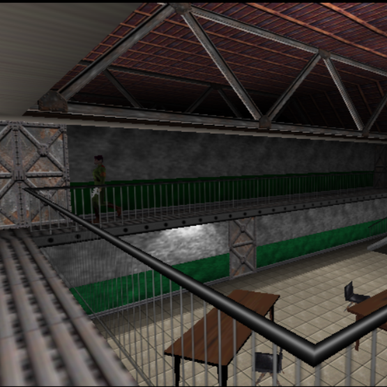
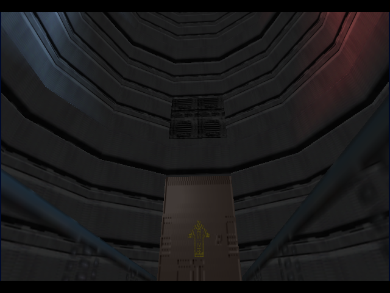
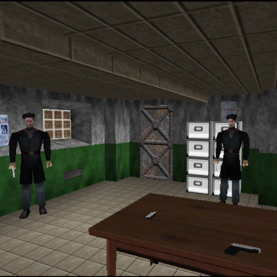
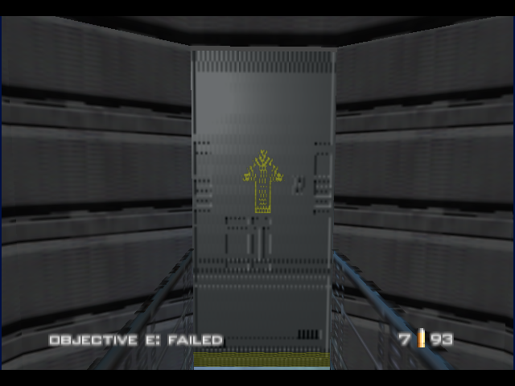
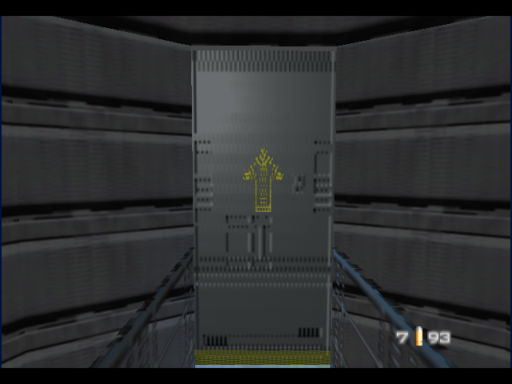
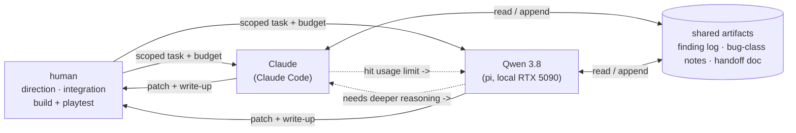

# GoldenEye 007 — PC port

A work-in-progress native port of **GoldenEye 007** (Rare, 1997) to modern
desktop platforms, built on top of the
[GoldenEye decompilation](https://github.com/n64decomp/007).

It follows the architecture of the
[Perfect Dark PC port](https://github.com/fgsfdsfgs/perfect_dark) — the same
Rare "Indy" engine family, one hardware generation apart. The unmodified game C
sources are compiled for the host; the N64's Reality Signal Processor is
emulated in software; every other hardware surface (video, audio, input,
timers, save storage) is shimmed in a dedicated `port/` layer.

> **You must supply your own GoldenEye 007 ROM.** This repository contains no
> Nintendo code or assets, and no ROM. Nothing here is distributable as a
> playable game — see [Requirements](#requirements) and [Legal](#legal).

<p align="center">
  
  
  <br>
  
  
  
  <br><em>In-engine captures &mdash; Archives and Bunker&nbsp;1 running in the port.</em>
</p>

## Background

This port is primarily a **research project on agentic software development** —
how far coding agents can be driven, by one person, through a large and
unfamiliar low-level codebase (~230 translation units of unmodified
big-endian MIPS game code, made to run on a 64-bit desktop).

It used two agents:

- a **local open-weight model** —
  `unsloth/Qwen3.8-27B-GGUF:UD-Q4_K_XL` on a single **RTX 5090**, driven mainly
  through the **[pi](https://pi.dev/)** coding agent (Unsloth Desktop was also
  trialed) — which did the groundwork: the CMake build, the boot chain, the
  software-RSP integration, the offline asset-conversion pipeline, and the
  first rendered frames;
- **Claude** (via **Claude Code** — mostly **Sonnet 5**, with **Opus 5** as an
  escalation tier for the hardest bugs), which joined on 27 Aug 2026 for a
  collaborative phase: the 21-level load/render/no-crash sweep, the ABI/layout
  finding catalogue, the SDL input layer, and the front-end flow.

The two **handed work back and forth** through shared written artifacts:



The handoff document was originally a session-to-session note; it became the
**interface between the two models** — when Claude hit a usage limit
mid-problem, the local model picked the task up from that state and continued.

**By the numbers:** ~2 weeks, one person part-time · 217 commits · 160
root-caused bugs logged · ~30 handoff sessions · `#ifdef PORT` ABI edits in 63
game-source files · ~17k lines of port layer + ~6k lines of Python asset
tooling. By day 4 the full ~230-unit codebase compiled and linked; by day 8
the intro rendered; by **day 13 all 21 solo missions ran crash-free**; by
day 14 the front end was playable end to end. Estimated effort split
(milestone-weighted): **~60% Claude / ~40% local model** — the local model
built the entire foundation (build, boot, RSP wiring, converters).

Full write-up, timeline chart, and an honest "what worked / what didn't":
[`docs/dev/agentic-development.md`](docs/dev/agentic-development.md). The
workflow itself: [`docs/dev-process.md`](docs/dev-process.md).

## Status

**Phase 2 of 4 (rendering).** The port boots, renders, and is playable through
the front end into the early game. It is not finished and it is not stable.

**Working**

- Boot -> Rare/Nintendo logos -> gun-barrel -> cast intro, fully rendered.
- Front end: main menu -> mission select -> difficulty -> briefing -> mission start.
- **All 21 solo missions load, render, and survive an unattended play window
  without crashing** (see [`docs/dev/LEVEL-STATUS.md`](docs/dev/LEVEL-STATUS.md)).
- Software RSP (fast3d): textured world geometry, skeletal characters, HUD,
  the GE-specific color-combiner / render modes and `G_TRI4`.
- Input: keyboard + mouse (with mode-aware mouse-look) and SDL game
  controllers, mapped onto the N64 pad. Tunable via `ge007.ini`.
- File-backed EEPROM saves.

**Not yet working**

- **Audio** — not implemented (Phase 3). The game runs silent.
- Front-end 3D models (spinning Nintendo logo, gun-barrel Bond, cast) are
  mispositioned or absent.
- Assorted cosmetic defects (some text layout, a few incomplete asset
  conversions) are tracked in
  [`docs/dev/GRAPHICS-BACKLOG.md`](docs/dev/GRAPHICS-BACKLOG.md) and parked
  below crash/level work.
- Only `x86_64` Windows and Linux are exercised regularly. No macOS/ARM
  testing yet; no controller rebinding UI; no widescreen.

## Requirements

You need a **GoldenEye 007 (Nintendo 64) ROM** that you legally own, in
big-endian (`.z64`) format, matching one of:

| Region | ROMID | ROM filename (in `data/`) | SHA-1 |
|--------|-------|---------------------------|-------|
| NTSC-U (US)  | `ntsc-final` | `ge007.ntsc-final.z64` | `abe01e4aeb033b6c0836819f549c791b26cfde83` |
| PAL (EU)     | `pal-final`  | `ge007.pal-final.z64`  | `167c3c433dec1f1eb921736f7d53fac8cb45ee31` |
| NTSC-J (JP)  | `jpn-final`  | `ge007.jpn-final.z64`  | `2a5dade32f7fad6c73c659d2026994632c1b3174` |

US is the recommended and best-tested version.

The port also relies on the decompilation's asset-extraction step, which pulls
the level, model, texture and music data out of your ROM at build time. That
step, too, requires your ROM and is part of [Building](#building).

## Building

Prerequisites: CMake >= 3.16, a C/C++ toolchain, SDL2, zlib, OpenGL, Python 3,
plus the decompilation's own build dependencies (an IRIX MIPS toolchain via
`qemu-irix`, used only for the one-time asset extraction). See
[`docs/building.md`](docs/building.md) for the full walkthrough and the
asset-extraction details.

### Windows (MSYS2)

```sh
# in the MINGW64 shell
pacman -S mingw-w64-x86_64-toolchain mingw-w64-x86_64-SDL2 \
          mingw-w64-x86_64-zlib mingw-w64-x86_64-cmake \
          mingw-w64-x86_64-python make git

git clone https://github.com/jkdansereau/goldeneye-pc-port.git
cd goldeneye-pc-port
# 1. extract assets from your ROM (see docs/building.md)
# 2. build the port
./build-pc.sh ntsc-final          # or pal-final / jpn-final
```

### Linux

```sh
sudo apt install build-essential cmake python3 libsdl2-dev zlib1g-dev libgl1-mesa-dev
git clone https://github.com/jkdansereau/goldeneye-pc-port.git
cd goldeneye-pc-port
# extract assets (docs/building.md), then:
./build-pc.sh ntsc-final
```

The executable is written to `build-pc/ge007.x86_64` (Windows: `.exe`).

## Running

1. Create a `data/` directory in the repo root.
2. Put your ROM in it, named as in the table above
   (e.g. `data/ge007.ntsc-final.z64`).
3. Run the executable **from the repo root**:
   `./build-pc/ge007.x86_64`.

Configuration is written to `ge007.ini` on first run.

### Default controls

| Action            | Keyboard / mouse        | Controller            |
|-------------------|-------------------------|-----------------------|
| Move / strafe     | `W` `A` `S` `D` / arrows | Left stick            |
| Aim / look        | Mouse                   | Right stick           |
| Fire (Z)          | Left mouse / `LCtrl`    | Right trigger         |
| Aim mode (R)      | Right mouse / `LShift`  | Left trigger          |
| Use / accept (A)  | `Space` / `E`           | A / X                 |
| Reload / cancel (B)| `R` / `F`              | B / Y / RB            |
| L trigger         | `Q`                     | LB                    |
| Start             | `Enter` / `Tab`         | Start                 |

Mouse sensitivity, Y-inversion and the aim/turn split are tunable in the
`[Input]` section of `ge007.ini`.

## How it works

The R4300 game code in `src/` is compiled **completely unmodified** — the
decompilation's control flow is treated as ground truth. Everything that would
touch N64 hardware is redirected into `port/`:

- **`port/fast3d/`** — a software RSP. It interprets the GBI display list the
  game builds each frame and emits OpenGL, bypassing the RDP. Adapted from the
  Perfect Dark port and extended for GoldenEye's custom GBI.
- **`port/src/gesched.c`** — replaces the RCP scheduler; instead of poking RSP
  registers it drives the software RSP directly.
- **`port/src/libultra.c`** — single-threaded shims for the libultra OS API
  (threads, messages, timers, PI/SI/AI/VI) over the host.
- **`port/src/{video,audio,input,fs,romdata,config}.c`** — the SDL2 / OpenGL /
  filesystem backends.

The 32->64-bit transition forces a small, catalogued class of mechanical
ABI-only edits to ROM-serialized structs (pointer-width reconciliation); these
change no behaviour and are documented individually.

Where it diverges from the Perfect Dark port: GoldenEye's N64 serialized asset
formats (level setup, models, backgrounds) are converted **offline** by a set
of Python "sidecar" converters in `tools_pc/`, rather than fixed up at load
time. See [`docs/internals.md`](docs/internals.md) and
[`docs/porting-notes.md`](docs/porting-notes.md).

## Project layout

```
CMakeLists.txt      PC build (parallel to the decomp's Makefile, which is untouched)
build-pc.sh         configure + build helper
src/  include/      the decompilation (game + libultra) - compiled unmodified
port/
  fast3d/           software RSP -> OpenGL
  src/              port layer (main, OS shims, video, audio, input, fs, ...)
  include/          port-facing headers
tools/  Makefile    the N64 build + asset extraction (from the decomp; do not modify)
tools_pc/           PC-port helper + analysis scripts
docs/               see below
```

## Documentation

- [`docs/building.md`](docs/building.md) — full build + asset-extraction guide.
- [`docs/internals.md`](docs/internals.md) — architecture, the RSP-emulation
  approach, GE-vs-PD engine differences, the phased plan.
- [`docs/porting-notes.md`](docs/porting-notes.md) — the recurring N64->PC bug
  classes hit during the port, with fixes.
- [`docs/dev/agentic-development.md`](docs/dev/agentic-development.md) — the
  research angle: the two-agent setup, timeline, handoff workflow, and a
  candid assessment of what did and didn't work.
- [`docs/dev-process.md`](docs/dev-process.md) — the investigation workflow in
  detail (budgets, file partitioning, the finding-log discipline).
- [`docs/dev/`](docs/dev/) — the raw engineering record: the full finding log,
  per-level status, graphics backlog, playtest matrices.
- [`docs/SetupGuide.md`](docs/SetupGuide.md),
  [`docs/StructureGuide.md`](docs/StructureGuide.md),
  [`docs/StyleGuide.md`](docs/StyleGuide.md) — inherited from the decompilation.

## Credits

This port is a thin layer on a large amount of other people's work.

**Prior work it is built on**

- The [GoldenEye 007 decompilation](https://github.com/n64decomp/007) — years of
  effort by kholdfuzion, Larry Ficken, and the project's contributors; plus
  zoinkity's GoldenEye documentation, which the decomp started from. This port
  is a fork of that repository.
- The [Perfect Dark PC port](https://github.com/fgsfdsfgs/perfect_dark)
  (Ryan Dwyer and contributors) — the reference architecture for this port and
  the source of the `fast3d` software RSP.
- The [Perfect Dark decompilation](https://github.com/n64decomp/perfect_dark) —
  the sibling decomp the PD port is built on.

**Vendored / adapted code**

- `port/fast3d/` — the software RSP, adapted from the PD port. It originates
  with the [Ship of Harkinian](https://github.com/HarbourMasters) /
  libultraship fast3d (© Emill, MaikelChan; MIT — see `port/fast3d/LICENSE.txt`),
  which itself descends from
  [sm64-port](https://github.com/sm64-port/sm64-port)'s fast3d and audio mixer.
- `port/fast3d/glad/` — OpenGL loader generated by
  [glad](https://github.com/Dav1dde/glad) (David Herberth, MIT).
- The decompilation toolchain: [`ido-static-recomp`](https://github.com/decompals/ido-static-recomp)
  (Emill / decompals), [`qemu-irix`](https://github.com/n64decomp/qemu-irix) and
  `rabbitizer` (n64decomp).
- [SDL2](https://libsdl.org) and [zlib](https://zlib.net).

**Methodology**

- Chris Lewis, [*"Decompiling a Nintendo 64 Game in 84 Days"*](https://blog.chrislewis.au/decompiling-a-nintendo-64-game-in-84-days/) (the Snowboard
  Kids decompilation write-up) — the agent-workflow practices in
  [`docs/dev-process.md`](docs/dev-process.md) are adapted from it.

**Tools and models used to develop the port**

- [Qwen 3.8](https://github.com/QwenLM/Qwen) (Alibaba Qwen team);
  [Unsloth](https://unsloth.ai) (the GGUF quantisation and Unsloth Desktop).
- [pi](https://pi.dev/) — the local coding-agent harness.
- [Claude / Claude Code](https://claude.com/claude-code) (Anthropic).

## Legal

This is a non-commercial fan preservation/research project, in the same
category as the many other N64 decompilation and native-port repositories on
GitHub. It follows the same conventions they do:

- **No ROM and no bulk game assets are distributed.** Textures, audio, models,
  level data and in-game text are extracted from a ROM *you already own*, on
  *your* machine, at build time.
- The repository is a fork of the public
  [GoldenEye 007 decompilation](https://github.com/n64decomp/007) and inherits
  its contents unmodified (see [`NOTICE`](NOTICE) for what that includes).
- No official logos, box art, or marketing assets are used. "GoldenEye 007",
  "007", "James Bond" and related marks belong to their respective owners
  (Nintendo, Microsoft/Rare, MGM, Danjaq, EON Productions).
- No binaries containing game data are distributed. Any build you make is
  personal to you.

This project is **not affiliated with, endorsed by, or sponsored by** Nintendo,
Rare, Microsoft, MGM, Danjaq, EON Productions, or any rights holder in
GoldenEye or James Bond. If you are a rights holder with a concern, open an
issue and it will be addressed.

## License

The original work in this repository — the port layer (`port/`), the PC build
system, `tools_pc/`, and the documentation — is released under the MIT License,
see [`LICENSE`](LICENSE). Everything inherited from the upstream decompilation
is covered by [`NOTICE`](NOTICE), not by that license.
