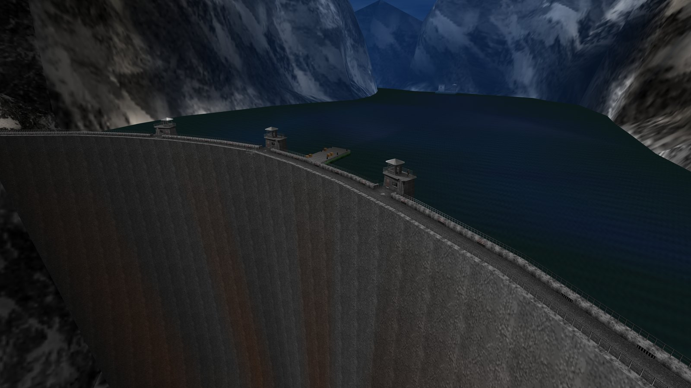

A native PC port of _GoldenEye 007_ (Rare, 1997, Nintendo 64), compiled from
the [GoldenEye 007 decompilation](https://github.com/n64decomp/007): the
original N64 game running from reconstructed source, not the Xbox 360
remaster. The N64's graphics coprocessor (RSP) is emulated in software; every
other hardware surface (video, audio, input, timers, save storage) is shimmed
in a dedicated `port/` layer, following the architecture of the
[Perfect Dark PC port](https://github.com/fgsfdsfgs/perfect_dark), the same
Rare "Indy" engine family, one hardware generation apart.

[Status](#status) · [Download](#download) · [See it running](#see-it-running) · [Known issues](#known-issues) · [Documentation](#documentation)

## Status

### v0.5.0 (2026-10-05) — the campaign and split-screen both run end to end.

- **Single-player campaign complete.** All 20 missions plus the
  ending-credits sequence, completable end to end at a steady 60 fps.
- **2–4 player split-screen multiplayer.** Supported on every multiplayer
  map; playtested on Windows, Linux and Steam Deck.
- **One real options system.** A single menu, laid out like the Perfect
  Dark port's — plain-English wording, real-unit sliders, a one-line
  description per option — with the game's own **N64 control styles as a
  per-seat preset**.
- **Emulator save files load directly.** Copy a 1964 / Project64 save into
  `data/` and it is converted on first launch.
- **A scalable HUD overlay**, fullscreen and window-centring controls, and
  antialiased overlay controls.
- **A fidelity round checked frame-by-frame against the N64 game** (fog,
  aspect-ratio letterboxing, the Watch menu's own settings), with the
  reference-frame gate re-based on both platforms (21 levels, 63 frames
  each).
- The small stuff: a menu wording, units and help-text pass, and
  standardised menu spelling.

What remains is a short list, under [Known issues](#known-issues).

**This is a pre-1.0 release, not a finished product.** v1.0 is the target
for a polished, feature-complete build; expect missing features and the
occasional breaking change until then. The [README's Roadmap
section](https://github.com/jkdansereau/goldeneye-pc-port#roadmap) is the
single tracker for what comes next.

Known issues

Full table in the <a href="https://github.com/jkdansereau/goldeneye-pc-port/blob/main/docs/ROADMAP.md#known-issues">roadmap's known-issues section</a>; root causes in the <a href="https://github.com/jkdansereau/goldeneye-pc-port/tree/main/docs/dev">finding log</a>.

<ul>
<li><strong>NTSC-U ROMs only in the release packages.</strong> PAL and JP ROMs convert, build and run from source, but release packages ship the US (NTSC-U) ROM. On the roadmap.</li>
<li><strong>Changing the aspect ratio in a level can briefly glitch the gun/hand model</strong> (cosmetic, one-off). Change the ratio from the front-end PC Options, or accept it (D509).</li>
<li><strong>No macOS or ARM builds yet.</strong> Today the release ships Windows, Linux and Steam Deck (keyboard, mouse and controller-button rebinding are all supported, defaults in the <a href="https://github.com/jkdansereau/goldeneye-pc-port#controls">README's Controls section</a>); macOS and ARM are on the roadmap.</li>
<li><strong><code>Skip intro</code> and <code>All unlocked</code> are experimental</strong> — leave them off for a normal playthrough. <code>All unlocked</code> has not written your save since v0.4.1, but saves made while it was on in builds before v0.4.1 can hold fake unlocks and are not repaired; back up <code>data/ge007.eep</code> if you used it on an older build (D442, D387).</li>
<li><strong>The first frame of a level takes a little longer</strong> while its textures upload — a brief FPS-counter dip; nothing to fix (D475, D480).</li>
<li><strong>In widescreen, far objects almost fully in fog can still show a faint distant building edge</strong> (4:3 matches the N64). Cosmetic (D503).</li>
</ul>

Release history

<strong>Warning:</strong> always use the latest release — earlier builds are kept in the release history for reference only; they lack the features and fixes of newer versions, so don't install an older release.

<ul>
<li><strong>2026-10-05 — v0.5.0</strong>: what it adds is the Status list above. <a href="https://github.com/jkdansereau/goldeneye-pc-port/releases/tag/v0.5.0">Release notes</a>.</li>
<li><strong>2026-09-28 — v0.4.0</strong>: native widescreen, a complete aim system for mouse and controller, in-game key rebinding, crosshair customization, rumble-pak haptics, a rebuilt options overlay, and a broad fidelity-fix pass. <a href="https://github.com/jkdansereau/goldeneye-pc-port/releases/tag/v0.4.0">Release notes</a>.</li>
<li><strong>2026-09-20 — v0.3.0</strong>: the first release with the complete campaign playable end to end at 60 fps on Windows, Linux, and Steam Deck. <a href="https://github.com/jkdansereau/goldeneye-pc-port/releases/tag/v0.3.0">Release notes</a>.</li>
<li><strong>2026-09-04 → 2026-09-16 — v0.1.0 – v0.2.2</strong>: the alpha and beta cycle — build chain, software RSP, first rendered frames, front end, and per-level stabilization across the campaign.</li>
</ul>

## Download

| Platform | Bundle | Notes |
|---|---|---|
| **Windows** (x86_64) | [win64.zip](https://github.com/jkdansereau/goldeneye-pc-port/releases) | Engine + runtime DLLs + the one-time asset tool. |
| **Linux** (x86_64) / **Steam Deck** | [linux tarball](https://github.com/jkdansereau/goldeneye-pc-port/releases) | SDL2 is bundled, so it runs as-is on any distro, and sideloads onto a Deck with nothing installed. |
| macOS / ARM Linux | — | Roadmap: not shipped yet. |

**Bring your own ROM.** Both bundles contain no ROM and no game assets: you
supply your own GoldenEye 007 N64 ROM (the
[Requirements table](https://github.com/jkdansereau/goldeneye-pc-port#requirements)
has the region filenames and SHA-1s). This release supports the NTSC-U (US)
ROM; PAL and JP are on the roadmap. Then: unpack, drop the ROM in `data/`,
and launch; the first run generates the derived assets automatically (no
Python or other tooling needed). The full steps are in the
[Quick start](https://github.com/jkdansereau/goldeneye-pc-port#quick-start);
  the packages carry no ROM or game assets, and run only with a ROM you
already own. The binaries are not code-signed; each
release artifact carries a GitHub build-provenance attestation you can
verify with `gh attestation verify <file> --repo
jkdansereau/goldeneye-pc-port`.

What the release actually installs is covered on [Security status](security.md);
how faithfully it tracks the N64 game, on [Fidelity status](fidelity.md).

## See it running

  

    <i></i><i></i><i></i>
    viewer &mdash; in-engine captures, 3072&times;1728
    1 / 12
  

  

    
    <button class="vbtn prev" id="vPrev" aria-label="previous capture">&#8249;</button>
    <button class="vbtn next" id="vNext" aria-label="next capture">&#8250;</button>
  

  
Dam &mdash; v0.4.0 intro attract

## Play it, or take it apart

- **Try it yourself**: grab a bundle above, bring your own ROM, and play the
  campaign. It's a pre-1.0 build for exactly this: if something breaks, an
  [issue](https://github.com/jkdansereau/goldeneye-pc-port/issues) with what
  you were doing is genuinely useful.
- **Read the code**: the game logic in `src/` is unmodified decompilation;
  every hardware surface (video, audio, input, save storage, and the
  software-RSP renderer) is shimmed in the MIT-licensed `port/` layer.
  [Internals](internals.md) is the map; [Porting notes](porting-notes.md) is
  the catalogue of N64→PC bug classes hit along the way, a good read even if
  you never touch the code.
- **Mod it**: the port layer, build system and `tools_pc/` helpers are MIT
  licensed and yours to extend: new video options, input tweaks, your own
  asset sidecar. [CONTRIBUTING](https://github.com/jkdansereau/goldeneye-pc-port/blob/main/CONTRIBUTING.md)
  has the ground rules that keep it faithful to the original game.
- **AI disclosure**: development here used AI coding agents — Claude Code
  plus a local open-weight model on a single RTX 5090, directed by one person
  in their spare time. The project is as much a study of that process as it
  is a port; the write-up records what happened and takes no position for or
  against using LLMs on a project like this. See [the full
  write-up](dev/agentic-development.md) — the setup, timeline, handoff
  workflow, and an honest account of what did and didn't work.

## How it works

The R4300 game code's logic and control flow are the decompilation's, and
remain the reference we preserve. The port's changes inside `src/` are few in
kind and each is gated behind `#ifdef PORT`: mechanical 32→64-bit
pointer-width fixes, a couple of approved timing fixes, and the opt-in
*All unlocked* and *Skip intro* hooks. The N64's Reality Signal Processor
(RSP), the graphics coprocessor that builds and executes each frame's
display list, is emulated in software: the port interprets the graphics
command stream (GBI) the game emits and translates it to OpenGL, bypassing
the RDP entirely. Everything else that would touch N64 hardware (video,
audio, input, timers, save storage) is shimmed in a small dedicated layer,
following the architecture of the Perfect Dark PC port from the same Rare
engine family. Full detail: [Internals](internals.md); the bug
catalogue: [Porting notes](porting-notes.md).

## Documentation

The technical docs live on the [Documentation](documentation.md) page — the
architecture, the N64→PC bug catalogue, and how the project is developed.
[Building](building.md) covers building and running from source.

