A native PC port of _GoldenEye 007_ (Rare, 1997, Nintendo 64), compiled from
the [GoldenEye 007 decompilation](https://github.com/n64decomp/007): the
original N64 game running from reconstructed source, not the Xbox 360
remaster. The N64's graphics coprocessor (RSP) is emulated in software; every
other hardware surface (video, audio, input, timers, save storage) is shimmed
in a dedicated `port/` layer, following the architecture of the
[Perfect Dark PC port](https://github.com/fgsfdsfgs/perfect_dark), the same
Rare "Indy" engine family, one hardware generation apart.

[Download](#download) · [News](#news) · [See it running](#see-it-running) · [Known issues](#known-issues) · [Documentation](#documentation)

**Status: v0.5.0 (2026-10-05) — fully playable, with a small set of known
caveats.** The single-player campaign and the 2–4 player split-screen
multiplayer both run at a steady 60 fps. The single-player campaign is
completable end to end (all 20 missions plus the ending-credits sequence),
and the 2–4 player split-screen campaign is supported on every multiplayer
map; both were playtested on Windows, Linux and Steam Deck. This release
adds **one
options menu** (laid out like the Perfect Dark port's, with plain-English
wording, real-unit sliders and a one-line description per option), the game's
own **N64 control styles as a per-seat preset**, **direct loading of
emulator save files**, a **scalable HUD overlay**, fullscreen and
window-centring controls, and a **fidelity round checked frame-by-frame
against the N64 game** (fog, aspect-ratio letterboxing, the Watch menu's own
settings). What remains is a short list, under
[Known issues](#known-issues).

**This is a pre-1.0 release, not a finished product** — v1.0 is the target
for a polished, feature-complete build; expect missing features and the
occasional breaking change until then. See the
[README's Roadmap section](https://github.com/jkdansereau/goldeneye-pc-port#roadmap)
for direction (PAL/JP ROM support, macOS and ARM builds, the remaining small
accuracy differences, and post-1.0 opt-in extras).

## News

- **2026-10-05** — **v0.5.0**: one options menu with plain-English wording,
  real-unit sliders and a one-line description per option; the N64 control
  styles as a per-seat preset; direct emulator-save loading; a scalable HUD
  overlay; fullscreen and window-centring controls; and a fidelity round
  checked frame-by-frame against the N64 game. The reference-frame gate was
  re-based on both platforms (21 levels, 63 frames each).
  [Release notes](https://github.com/jkdansereau/goldeneye-pc-port/releases/tag/v0.5.0) ·
  [downloads](#download).
- **2026-09-28** — **v0.4.0**: native widescreen, a complete aim system for
  mouse and controller, in-game key rebinding, crosshair customization,
  rumble-pak haptics, a rebuilt options overlay, and a broad fidelity-fix
  pass (water, particles, billboard trees, front-end logo, gunshot SFX, a
  true stable 60 fps). [Release notes](https://github.com/jkdansereau/goldeneye-pc-port/releases/tag/v0.4.0) ·
  [downloads](#download).
- **2026-09-20** — **v0.3.0**: the first release with the complete campaign
  playable end to end at 60 fps on Windows, Linux, and Steam Deck.
  [Release notes](https://github.com/jkdansereau/goldeneye-pc-port/releases/tag/v0.3.0).
- **2026-09-04 → 2026-09-16** — **v0.1.0 – v0.2.2**: the alpha and beta
  cycle — build chain, software RSP, first rendered frames, front end, and
  per-level stabilization across the campaign.

## Download

| Platform | Bundle | Notes |
|---|---|---|
| **Windows** (x86_64) | [win64.zip](https://github.com/jkdansereau/goldeneye-pc-port/releases) | Engine + runtime DLLs + the one-time asset tool. |
| **Linux** (x86_64) / **Steam Deck** | [linux tarball](https://github.com/jkdansereau/goldeneye-pc-port/releases) | SDL2 is bundled, so it runs as-is on any distro, and sideloads onto a Deck with nothing installed. |

**Bring your own ROM.** Both bundles contain no ROM and no game assets: you
supply your own GoldenEye 007 N64 ROM (the
[Requirements table](https://github.com/jkdansereau/goldeneye-pc-port#requirements)
has the region filenames and SHA-1s). This release supports the NTSC-U (US)
ROM; PAL and JP are on the roadmap. Then: unpack, drop the ROM in `data/`,
and launch; the first run generates the derived assets automatically (no
Python or other tooling needed). The full steps are in the
[Quick start](https://github.com/jkdansereau/goldeneye-pc-port#quick-start);
pre-built releases are legal to distribute precisely because they're useless
without a ROM you already own.

## See it running

  

    <i></i><i></i><i></i>
    viewer &mdash; in-engine captures, 3072&times;1728
    1 / 12
  

  

    
    <button class="vbtn prev" id="vPrev" aria-label="previous capture">&#8249;</button>
    <button class="vbtn next" id="vNext" aria-label="next capture">&#8250;</button>
  

  
Dam &mdash; v0.4.0 intro attract

<strong>Full gallery</strong>: 12 in-engine captures from a v0.4.0 intro-attract pass (3072×1728 widescreen, Sep 2026)

  

    
    
<small>Dam</small>

  

  

    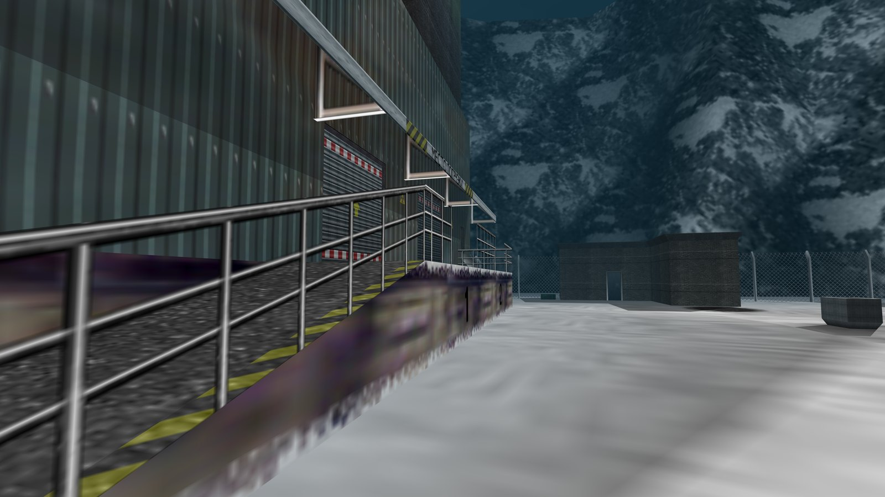
    
<small>Runway</small>

  

  

    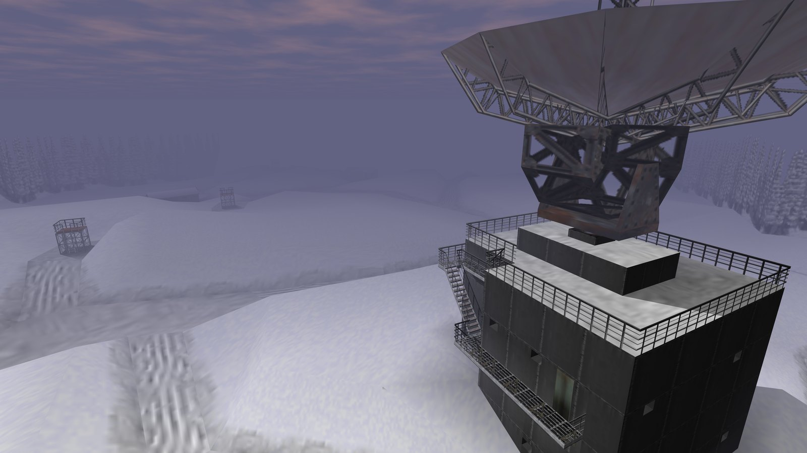
    
<small>Surface</small>

  

  

    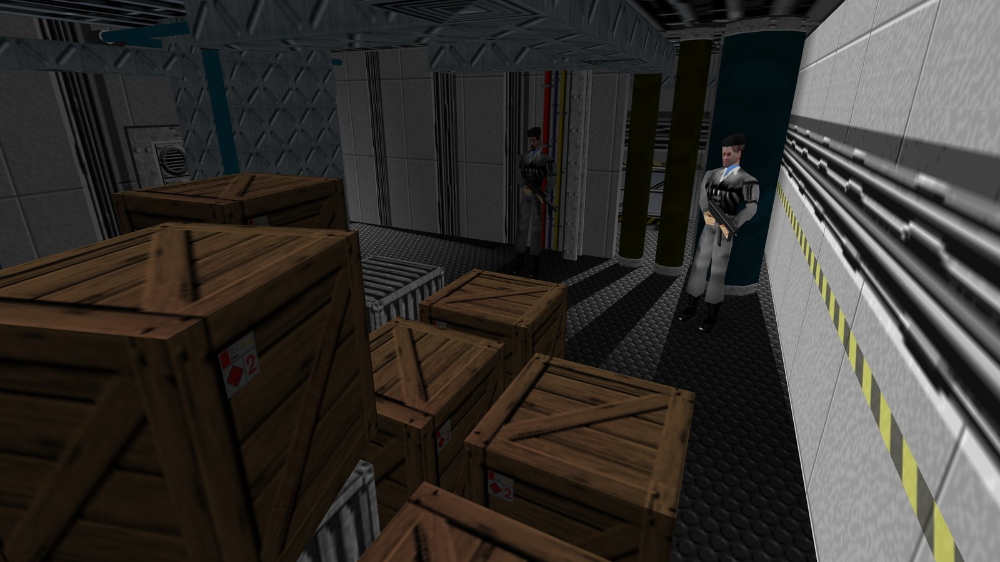
    
<small>Frigate</small>

  

  

    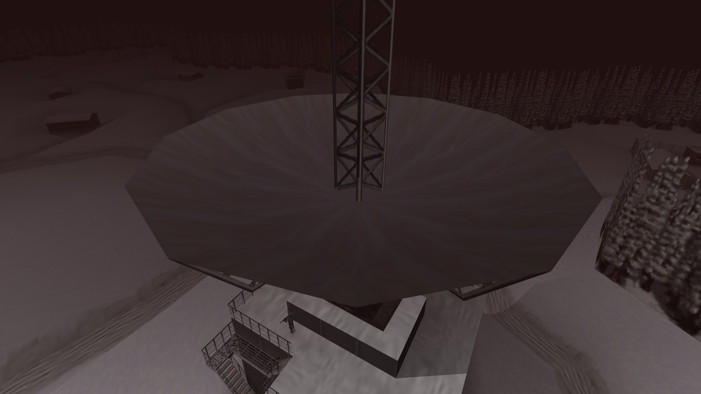
    
<small>Surface 2</small>

  

  

    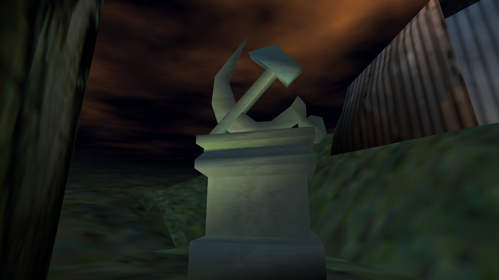
    
<small>Statue</small>

  

  

    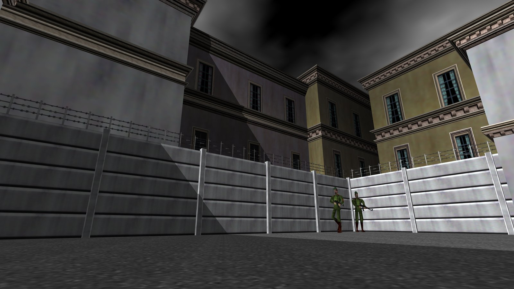
    
<small>Archives</small>

  

  

    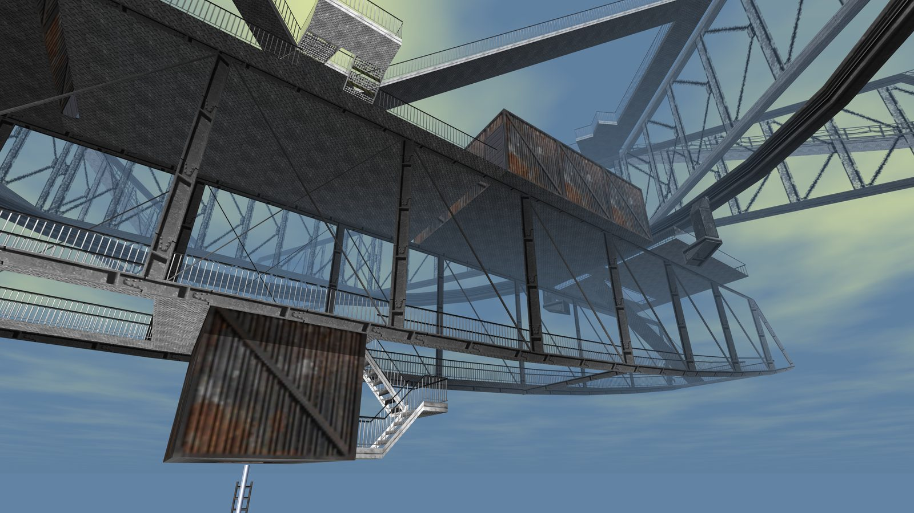
    
<small>Cradle</small>

  

  

    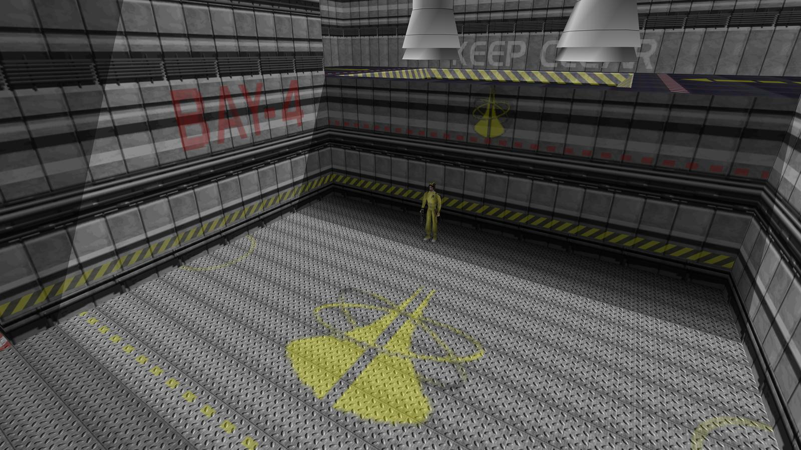
    
<small>Aztec</small>

  

  

    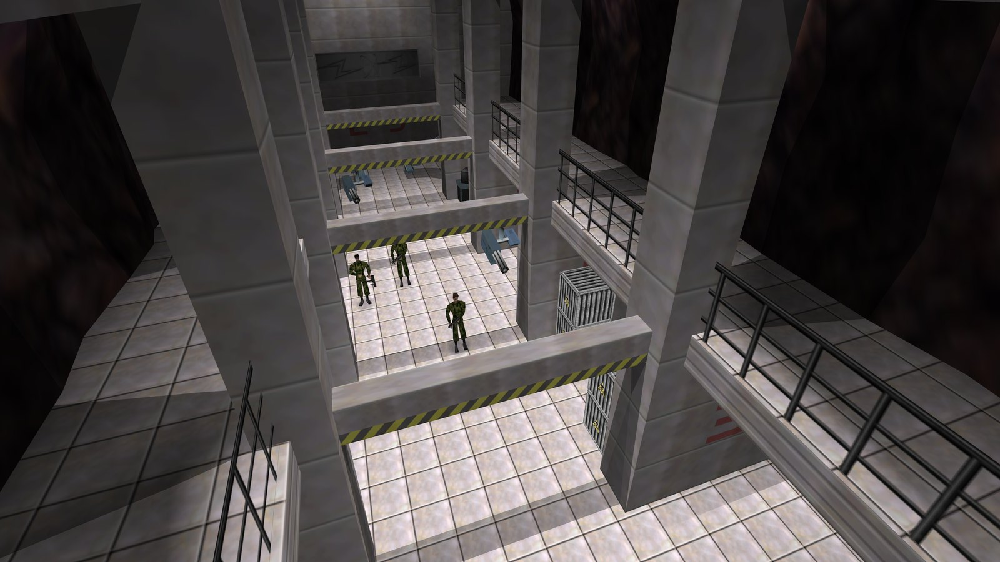
    
<small>Control</small>

  

  

    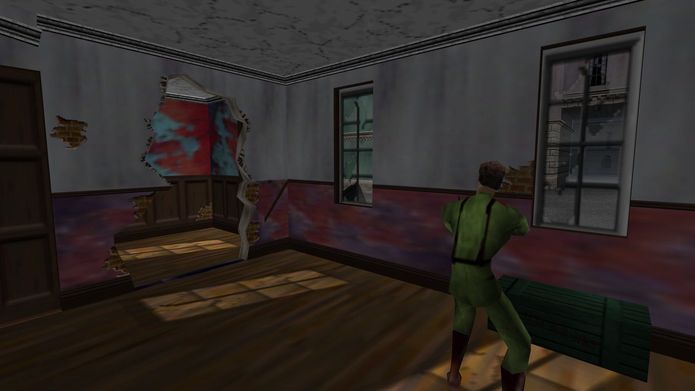
    
<small>Streets</small>

  

  

    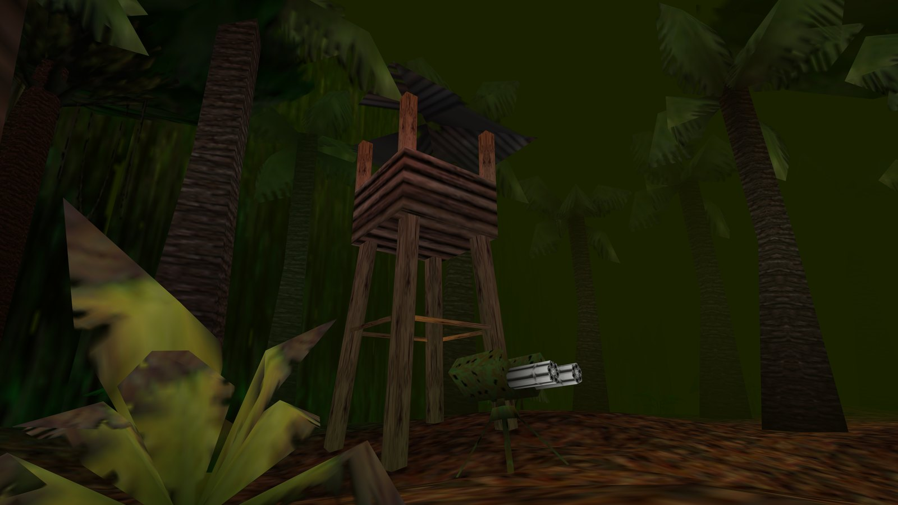
    
<small>Jungle</small>

  

More captures may land here as playtesting continues.

## Play it, or take it apart

- **Try it yourself**: grab a bundle above, bring your own ROM, and play the
  campaign. It's an early cut for exactly this: if something breaks, an
  [issue](https://github.com/jkdansereau/goldeneye-pc-port/issues) with what
  you were doing is genuinely useful.
- **Read the code**: the game logic in `src/` is unmodified decompilation;
  every hardware surface (video, audio, input, save storage, and the
  software-RSP renderer) is shimmed in the MIT-licensed `port/` layer.
  [Internals](internals.md) is the map; [Porting notes](porting-notes.md) is
  the catalogue of N64→PC bug classes hit along the way, a good read even if
  you never touch the code.
- **Mod it**: the port layer, build system and `tools_pc/` helpers are MIT
  licensed and yours to extend: new video options, input tweaks, your own
  asset sidecar. [CONTRIBUTING](https://github.com/jkdansereau/goldeneye-pc-port/blob/main/CONTRIBUTING.md)
  has the ground rules that keep it faithful to the original game.
- **AI disclosure**: development here used AI coding agents — Claude Code
  plus a local open-weight model on a single RTX 5090, directed by one person in their
  spare time. The project is as much a study of that process as it is a
  port, and the write-up is written to let you judge the result for yourself;
  it records what happened and takes no position for or against using LLMs
  on a project like this. See [the full
  write-up](dev/agentic-development.md) — the setup, timeline, handoff
  workflow, and an honest account of what did and didn't work.

## How it works

The R4300 game code's logic and control flow are the decompilation's, and remain the
reference we preserve. The port's changes inside `src/` are few in kind (mostly mechanical 32→64-bit pointer fixes, a couple of approved timing fixes, and the opt-in *All unlocked* hook), each gated behind `#ifdef PORT`. The N64's Reality Signal Processor, the graphics
coprocessor that builds and executes each frame's display list, is emulated in
software: the port interprets the graphics command stream (GBI) the game emits and translates it
to OpenGL, bypassing the RDP entirely. Everything else that would touch N64
hardware (video, audio, input, timers, save storage) is shimmed in a small
dedicated layer, following the architecture of the Perfect Dark PC port from
the same Rare engine family. Full detail: [Internals](internals.md); the bug
catalogue: [Porting notes](porting-notes.md).

## Known issues

Known defects and limitations as of v0.5.0, each with its finding-log
reference. The full list, with root causes and fix status: the
[release notes](https://github.com/jkdansereau/goldeneye-pc-port/releases)
and the [finding log](https://github.com/jkdansereau/goldeneye-pc-port/tree/main/docs/dev).

- **Facility — gas leak during Ourumov's monologue (D318).** If gas leaks,
  he can pause for up to ~10 s before the scripted shootout resumes. The
  race exists in the N64 original too (where it softlocks permanently);
  the port detects it and auto-recovers.
- **F10 options overlay under native widescreen (D335b).** The overlay
  stretches with the window instead of pillarboxing like the front-end
  menus. Legible, cosmetic only; the F10 *Native widescreen* toggle
  restores the old stretched frame throughout. The world/HUD widescreen
  rendering itself is correct.
- **Front-end Rareware logo (D75).** A subtle texture-filtering artifact;
  the Nintendo logo and legal page are clean. Cosmetic only.
- **`All unlocked` is experimental (D387).** The fresh-install corruption
  case is fixed, but saves made while it is on are not guaranteed
  recoverable by switching it off — complete a level normally first, and
  back up `data/ge007.eep` before enabling it.
- **No macOS or ARM builds yet** (both are on the
  [roadmap](https://github.com/jkdansereau/goldeneye-pc-port#roadmap));
  today the release ships Windows, Linux and Steam Deck. Keyboard, mouse
  and controller-button rebinding are all supported (defaults in the
  [README's Controls section](https://github.com/jkdansereau/goldeneye-pc-port#controls)).

What the release actually installs, and how faithfully it tracks the N64
game: [Security & fidelity status](security-and-fidelity-status.md).

## Documentation

The technical docs live under [under the
hood](under-the-hood.md) — the architecture, the N64→PC bug catalogue, and
how the project is developed. [Building](building.md) covers building and
running from source.

